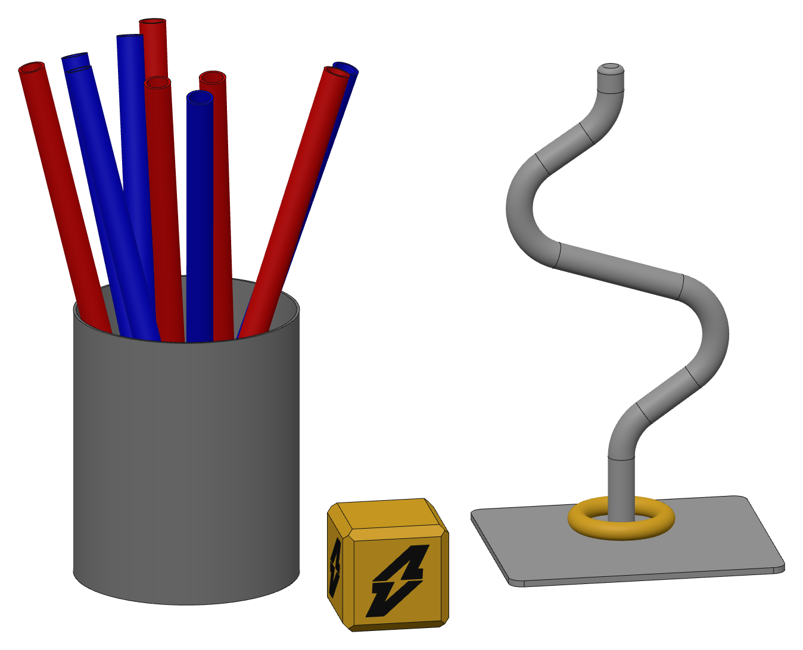
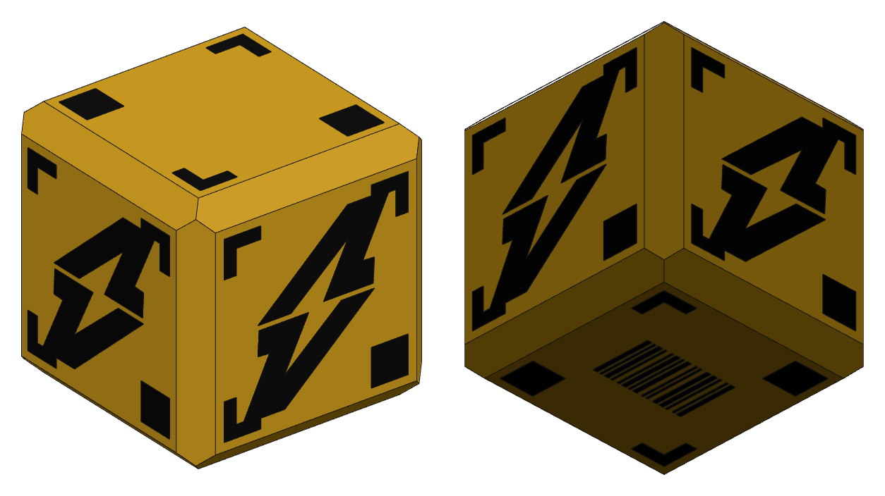

# Game element CAD models

These are CAD models of the game elements in the reference render: the cup of red and blue tubes, the cube, and the buzz-wire stand with its ring. They are sized from the official 200 mm cube drawing. All dimensions are in millimetres.





## Files

| File | Contents |
| --- | --- |
| `step/scene.step` | Every part, laid out as in the reference picture (assembly with colours) |
| `step/cube_200.step` | The cube, with the lightning logo on all four sides |
| `step/cube_200_fiducials.step` | The cube plus the corner markers and barcode from the drawing |
| `step/tube_cup.step` | The cup with all 10 tubes leaning in it |
| `step/cup.step`, `step/tube.step` | A single cup and a single tube |
| `step/buzz_wire_stand.step` | Base plate, wire and ring, assembled |
| `step/base_plate.step`, `step/wire.step`, `step/ring.step` | Each stand part on its own |
| `stl/*.stl` | Each part as a mesh, for printing or simulation |
| `scene.glb` | A quick-look copy of the scene that opens in any glTF viewer |
| `generate.py` | Regenerates all of the files above |

On the cube, the logos and markers are separate 0.3 mm thick black bodies that sit on the faces. The cube body itself stays exactly 200 mm.

## Dimensions

**Cube (from the drawing):**
- 200 × 200 × 200 with an 18 mm × 45° chamfer on all 12 edges, which leaves a 164 × 164 flat face.
- Fiducials: 30 mm markers at the corners of a 150 mm square, L-bracket arms 10 mm wide, 80 × 50 barcode on the bottom face.

**Everything else (measured from the render):**

| Part | Size |
| --- | --- |
| Cup | Ø420 OD × 510 tall, 5 mm wall, 10 mm floor |
| Tubes (5 red, 5 blue) | Ø50 OD / Ø40 ID × 1000 long, open ends |
| Wire | Ø50 solid rod standing 900 mm above the plate. Every bend is R100 on the centreline and the top end has a 10 mm fillet. Centreline corners (x, z) from the base: (0,0) (0,190) (300,400) (−320,600) (−20,800) (−20,900) |
| Ring | Torus, 200 OD / 130 ID, Ø35 section (40 mm clearance around the wire) |
| Base plate | 520 × 450 × 12 with R25 corners. The wire is centred left to right and sits 70 mm behind the plate centre |

The tubes in `scene.step` and `tube_cup.step` were placed to match the picture. Each tube rests on the cup floor. They clear each other by at least 2.9 mm and the cup wall by at least 3.2 mm.

## How the sizes were measured

Only the cube has a drawing, so it set the scale for everything else:

1. In the render, the cube's 164 mm flat face spans 147 px across and 143 px down. Together with the chamfer and top-face widths, this gives about 0.905 px/mm.
2. The same measurements show an orthographic camera looking down at about 17.5° and turned about 10°.
3. Every other part was measured in pixels, converted to mm with that camera and rounded. Expect those sizes to be within about ±5 %.

To check the result, the generated scene was rendered from the same camera and overlaid on the original picture. The parts line up to within a few pixels.

The render does not show these values, so they are guesses:
- cup wall and floor thickness
- tube wall (estimated from the visible tube ends)
- plate thickness
- the wire being a solid rod
- the logo on the back and side faces

To change any of them, edit the constants at the top of `generate.py` and run it again.

## Regenerating

```
python3 -m venv .venv && . .venv/bin/activate
pip install -r requirements.txt
python generate.py
```

The geometry is deterministic. In the assembly STEP files, though, OpenCASCADE can write the colour records in a different order from one run to the next.
